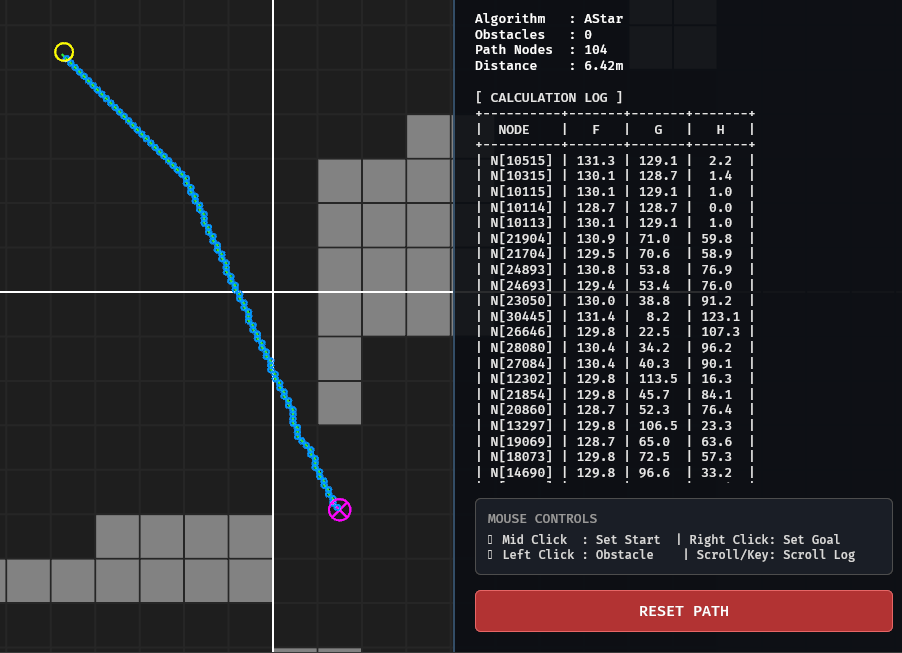

# BawalPathFinder 🐟

[English](README_en.md) | [Indonesia](README.md)
## Preview

## About the Project
**BawalPathFinder** is a robot navigation simulation system based on ROS 2 Nav2.
- **Backend**: ROS 2 Humble (Nav2) running inside a Docker Container to ensure environment isolation.
- **Frontend**: Bevy Engine (Rust) for real-time 2D/3D visualization.
- **Communication**: WebSocket (Rosbridge) connecting the Rust frontend with the ROS 2 backend.

## Tech Stack
* **Bevy (Rust)**: Rendering engine for the UI and path visualization.
* **ROS 2 (Humble)**: Primary middleware for navigation, planning, and costmaps.
* **CMake 3.10+**: Used to build C++ Nav2 plugins.
* **Python 3**: Used for helper scripts, testing map generation, and automation.

## Pathfinding Algorithms
This system supports several pathfinding algorithms. The core logic is implemented in C++ (Nav2 Plugins).

| Algorithm | Calculation Logic ($f(n) = g(n) + h(n)$) | Characteristics |
| :--- | :--- | :--- |
| **A\*** | $f(n) = g(n) + h(n)$ | Optimal & Fast (Cost + Heuristic). |
| **GBFS** | $f(n) = h(n)$ | Very fast, but does not guarantee the shortest path. |
| **Dijkstra / UCS** | $f(n) = g(n)$ | Guarantees the shortest path, but exploration is broad (slow). |

* **$g(n)$**: The actual cost from the start to the current node.
* **$h(n)$**: Estimated cost (Heuristic) from the current node to the goal.

> **Where to put C++ implementations?**
> To add or modify calculation logic, navigate to:
> `src/navigation/plugins/` or `src/navigation/src/`
> Ensure you adjust `CMakeLists.txt` if adding new `.cpp` or `.hpp` files so they compile into the ROS workspace.

## Setup & How to Run

### 1. System Requirements
Ensure your environment meets the following specifications:
- **OS**: Linux (Ubuntu 22.04 LTS highly recommended).
- **Toolchain**: Rust/Cargo (Edition 2021), C++17, Python 3.8+.
- **Docker**: Mandatory to run the backend.

### 2. Makefile Commands (Important!)
Use `make rebuild_all` as your primary command to ensure synchronization between the frontend and backend (this rebuilds the UI and re-syncs Docker).

| Command | Description |
| --- | --- |
| `make rebuild_all` | Cleans cache, rebuilds frontend & backend container. |
| `make run` | Runs the simulation (Frontend + Backend). |
| `make map` | Generates new map files using Python. |
| `make stop` | Stops the ROS container & Bevy process. |
| `make clean` | Deletes all build files and cache. |

### 3. Bash Scripts
If you prefer manual control:
- `./bash/run_all.sh`: Runs the entire simulation pipeline.
- `./bash/run_backend.sh`: Runs the navigation nodes separately.
- `./bash/cleanbackend.sh`: Cleans up ROS 2 zombie processes.

> [!NOTE]
> **Troubleshooting (Notes for v0.1.0-alpha)**
> * **Visual Path "Hanging"**: Nav2 uses an *inflation layer* (obstacle radius). The path may appear not to touch walls or goals precisely because the robot requires clearance.
> * **Code 6 (Planning Failed)**: If the goal is inside a *lethal cost* zone (collision), Nav2 will reject planning.
> * **"Zombie" Data**: If the path still appears after resetting, ensure the `cleanup_sim2d` function calls `cancel_goal` to `/compute_path_to_pose/_action/cancel_goal` to terminate backend calculations.